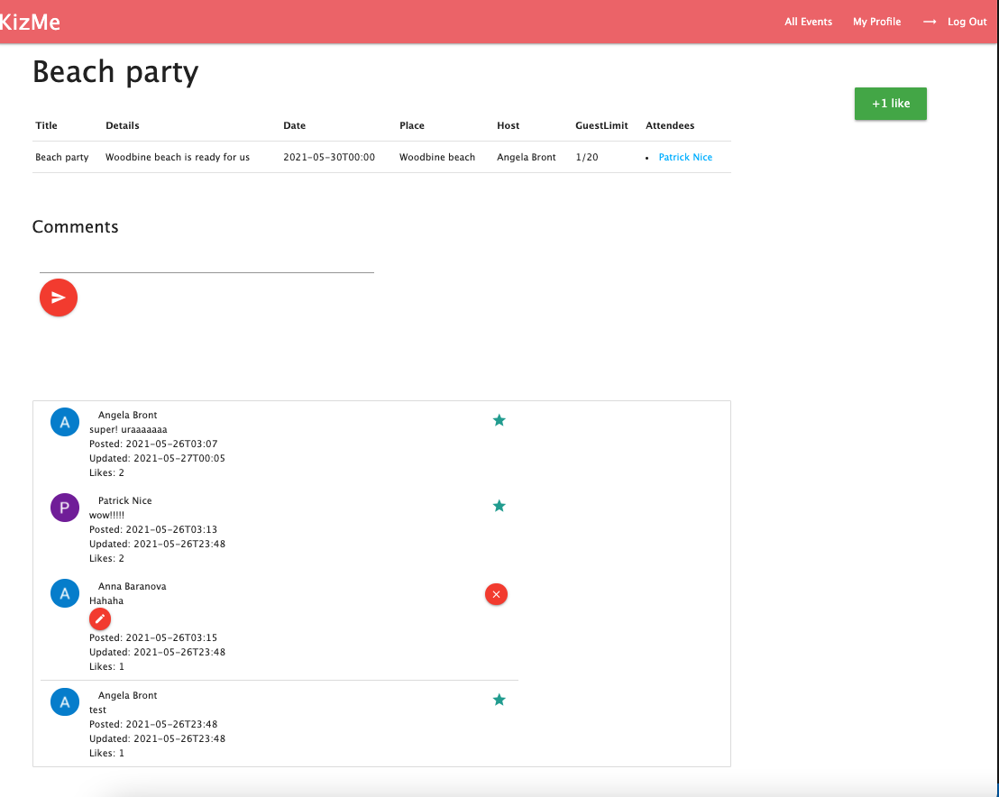

## Project 2 <br> Full-stack CRUD Application

# **KizMe. Parties for friends**

1. **About**: This app was created for my kizomba community. The app allows to create/update/delete an event, to look througth a list of events, to join/leave an event from the list, to add/delete/like comments.
2. **Technologies used**: HTML, CSS, JavaScript, Node.js, Express.js, MongoDB, Materialize

3. **Getting started**: [Link]()
* Install dependencies: 
```
npm install
```
*  Add environment variables:
```
DATABASE_URL=<database connection string>

GOOGLE_CLIENT_ID=<...>
GOOGLE_SECRET=<...>
GOOGLE_CALLBACK=http://<your server address and port>/oauth2callback

SESSION_SECRET=<...>
```

*  Run server:
```
npm run dev
```

4. **Examples of wareframe**: 


5. **User Stories**: [Trello](https://trello.com/b/8hvBQePf/kizme-app)

6. **ERD**: 


7. **Screenshots**:





8. **My biggest challenges**:

* Implementing AJAX to edit comments and add/remove "likes".
* Adding time validation to my forms.

9. **My key learnings**:

* AJAX
* RegEx
* User stories
* ERD

10. **Next steps**: 

* User story: As a Host, I want to approve Users to be my Attendees
